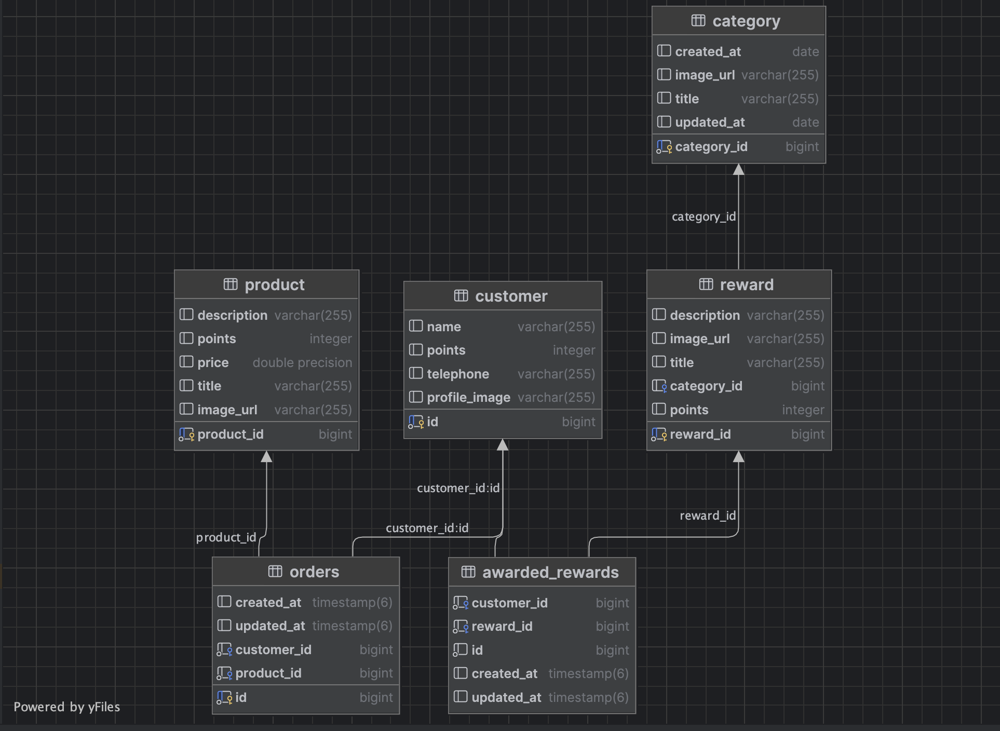

# README

## Approach

-   I have created the two blocks (popular rewards and loyal customers) because these two blocks were easy and fast to create, what i struggled with was the detail statistics block with the chart, i have never used material UI so i had to learn how to customize the chart.

-   For api part i create the easy crud apis first, for example managing the rewards (CRUD), what i did was i created a many to many relationship with customer table and rewards table, then later i needed to have the created_at column butI cannot do it by many to many relationship, so i created another table which contains the id of rewards and customers, and the created_at column.

-   one thing that i didn't worked on was the redeemed points, it is static for the moment, i forgot to ask you about it, it was my bad

## Risks

The only risk that i can seee if when the backend service is down, there is now way we could get the data from the frontend, but we can easily show a maintenance page. to inform the user that the service is down.

-   But what if not all the apis are down, in that case we can use error boundary to wrap each block with, and show a message to the user that this block or the rewards service is down.

## Technical Documentation

-   I have created the uml diagram to show the relationship between the tables.

